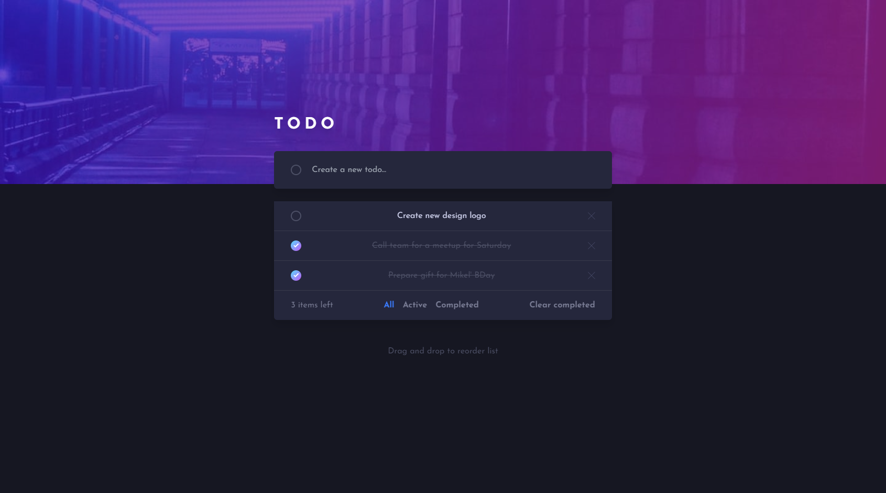
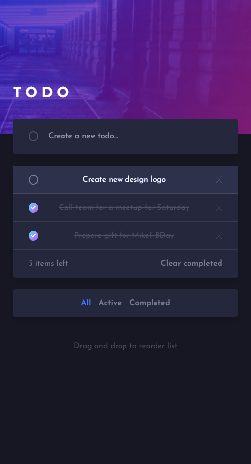

# Todo App

## Table of contents

- [Overview](#overview)
    - [The challenge](#the-challenge)
    - [Screenshot](#screenshot)
    - [Links](#links)
- [My process](#my-process)
    - [Built with](#built-with)
    - [Useful resources](#useful-resources)
- [Author](#author)

## Overview

### The challenge

Users are able to:

- View the optimal layout for the app depending on their device's screen size
- See hover states for all interactive elements on the page
- Add new todos to the list
- Mark todos as complete
- Delete todos from the list
- Filter by all/active/complete todos
- Clear all completed todos
- Drag and drop to reorder items on the list

### Screenshot

### Links

- Live Site URL: [Add live site URL here](https://your-live-site-url.com)

## My process

### Built with

- Semantic HTML5 markup
- CSS custom properties
- Flexbox
- Mobile-first workflow
- [React JS](https://vuejs.org/) - VUE framework
- [TailwindCSS](https://tailwindcss.ru/) - For styles

### Useful resources

- [Google Fonts](https://fonts.google.com/)

## Author

- Frontend Mentor - [@IlyaChichkov](https://www.frontendmentor.io/profile/IlyaChichkov)